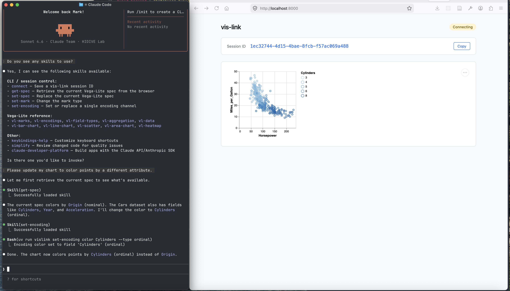

# vis-link-cli-and-skills

Background: MCP, which is only designed for machines to use, is being replaced by the simpler CLIs + Skills, which are designed for both humans and machines to use.

This is an experiment to create a minimal proof of concept:
- Frontend web page that renders a visualization. Should be minimal, ideally just an HTML file. Upon loading the page, it connects to the backend websocket server to "request" a SESSION_ID
  - For now, using Vega-Lite
- Backend server: the bridge between the frontend and the CLI. Should be as minimal as possible.
  - Use web sockets
  - Use python
- CLI tool for manipulating the visualization, with the following commands
  - `vislink connect SESSION_ID # Connect to a particular session`
  - `vislink get-spec # Get the current visualization specification`
  - `vislink set-spec # Set the current visualization specification`
  - More fine-grained getters and setters for changing marks/channels/etc. within the spec
 - Agent Skills directory of markdown files, one per CLI command, with concise name and description in frontmatter.

  Tech stack: Use the following technologies:
  - Plain HTML file with modern ESM JavaScript code for frontend
  - Python and Starlette framework for backend
    - Add a route to serve the frontend HTML via a Jinja2 template
  - Python and argparse for CLI
  - UV for python environment
  
-----
Vibe-coded: The initial implementation was created based on the README contents above along with the prompt: Implement this.

Caveat: Vega-Lite and its example datasets are well represented in training data, so this may perform worse with a different visualization framework or with unseen datasets.


-----

## Natural Language Usage

```
> Please run the server in the background.
...
*open browser to obtain session ID*
...
> My vislink session ID is {pasted}
...
> Please color the points by a different attribute.
...
```

## Manual Usage

### 1. Install dependencies

```bash
uv sync
```

### 2. Start the server

```bash
uv run uvicorn server:app --reload
```

### 3. Open the browser

Navigate to `http://localhost:8000`. The page displays a session ID and a default Vega-Lite scatter plot.

### 4. Connect the CLI to the browser session

Copy the session ID from the browser and run:

```bash
uv run vislink connect SESSION_ID
```

The session is saved to `~/.vislink/session` and used by all subsequent commands.

**Per-shell override:** Set the `VISLINK_SESSION` environment variable to target a specific session without overwriting the saved file. This takes priority over the saved session and is useful when working with multiple browser tabs simultaneously.

```bash
VISLINK_SESSION=abc123 vislink get-spec
# or export it for the duration of a shell session
export VISLINK_SESSION=abc123
```

### 5. Inspect and modify the visualization

```bash
# Print the current spec as JSON
uv run vislink get-spec

# Change the mark type
uv run vislink set-mark bar
uv run vislink set-mark line

# Update an encoding channel
uv run vislink set-encoding x Name --type nominal
uv run vislink set-encoding y Miles_per_Gallon --aggregate mean --title "Avg MPG"

# Replace the entire spec from a file
uv run vislink set-spec --file my_chart.json

# Replace the entire spec from a JSON string
uv run vislink set-spec --spec '{"$schema":"https://vega.github.io/schema/vega-lite/v5.json","data":{"url":"https://vega.github.io/vega-datasets/data/cars.json"},"mark":"bar","encoding":{"x":{"field":"Origin","type":"nominal"},"y":{"aggregate":"count","type":"quantitative"}}}'
```

### Optional: install the CLI globally

```bash
uv tool install .
vislink connect SESSION_ID
```

## CLI reference

| Command | Arguments | Description |
|---------|-----------|-------------|
| `connect` | `SESSION_ID` | Save a session ID for subsequent commands |
| `get-spec` | — | Print the current Vega-Lite spec as JSON |
| `set-spec` | `--file PATH` or `--spec JSON` | Replace the current spec |
| `set-mark` | `MARK` | Change the mark type (`point`, `bar`, `line`, `area`, `rect`, `arc`, `text`, `tick`, `rule`) |
| `set-encoding` | `CHANNEL FIELD [--type] [--aggregate] [--title]` | Set or replace one encoding channel |

## Skills

The `.claude/skills/` directory contains markdown files (with YAML frontmatter) that agents can use as context:

**CLI skills:** `connect`, `get-spec`, `set-spec`, `set-mark`, `set-encoding`

**Vega-Lite reference:** `vl-bar-chart`, `vl-line-chart`, `vl-scatter`, `vl-area-chart`, `vl-heatmap`, `vl-marks`, `vl-encodings`, `vl-field-types`, `vl-aggregation`, `vl-data`

## Screenshot



## Related work

- https://github.com/flekschas/mcp-web
- https://github.com/vitessce/vitessce-link
